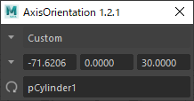

# nkAxisOrientation

<!-- [](https://github.com/imaoki/nkAxisOrientation/releases/latest) -->
[](https://github.com/imaoki/nkAxisOrientation/blob/main/LICENSE)

移動/回転/スケールツールのAxis Orientationを設定する。

## 特徴

* 移動/回転/スケールツール設定のAxis Orientationと同期。

  

* カスタム軸用のトランスフォームオブジェクトを保持し、任意のタイミングでカスタム軸を更新可能。

  

## ライセンス

[MIT License](https://github.com/imaoki/nkAxisOrientation/blob/main/LICENSE)

<!-- ## 要件 -->

<!-- * [imaoki/Standard](https://github.com/imaoki/Standard) -->

## 開発環境

`Maya 2022.5`

## インストール

01. ファイルをコピーする。

    英語版
    : `%MAYA_APP_DIR%\<version>\scripts`

    日本語版
    : `%MAYA_APP_DIR%\<version>\ja_JP\scripts`

    複数バージョン
    : `%MAYA_APP_DIR%\scripts`

02. Mayaを再起動

## 使い方

```mel
nkAxisOrientation();
```

<!-- ## 制限 -->

<!-- * 制限 -->

<!-- ## 既知の問題 -->

<!-- * 問題 -->

<!-- ## 追加情報 -->
