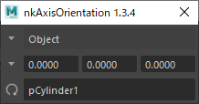
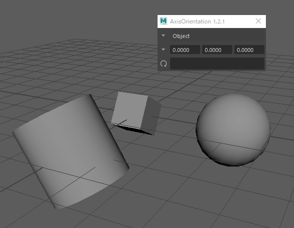

# nkAxisOrientation

[](https://github.com/imaoki/nkAxisOrientation/releases/latest)

移動/回転/スケールツールのAxis Orientationを設定するMELツール。

## 特徴

* 移動/回転/スケールツール設定のAxis Orientationと同期。

  

* カスタム軸用のトランスフォームオブジェクトを保持し、任意のタイミングでカスタム軸を更新可能。

  

## ライセンス

[MIT License](https://github.com/imaoki/nkAxisOrientation/blob/main/LICENSE)

<!-- ## 要件 -->

<!-- * [imaoki/Standard](https://github.com/imaoki/Standard) -->

## 開発環境

Maya 2022.5 / Windows 10

## インストール

01. `nkAxisOrientation.mel`をスクリプトディレクトリにコピー

    | バージョン | ディレクトリ                             |
    | ---------- | ---------------------------------------- |
    | 英語版     | `%MAYA_APP_DIR%\<version>\scripts`       |
    | 日本語版   | `%MAYA_APP_DIR%\<version>\ja_JP\scripts` |

02. Mayaを再起動

## 起動方法

```mel
nkAxisOrientation;
```

<!-- ## 使い方 -->

<!-- ## 制限 -->

<!-- * 制限 -->

<!-- ## 既知の問題 -->

<!-- * 問題 -->

## 追加情報

* 標準のツール設定と同様に、メニューボタン（▼）をマウス中ボタンでクリックすると前回選択していたモードに切り替えることができます。
  カスタム軸の選択メニューボタンの場合は前回の項目を再実行。
